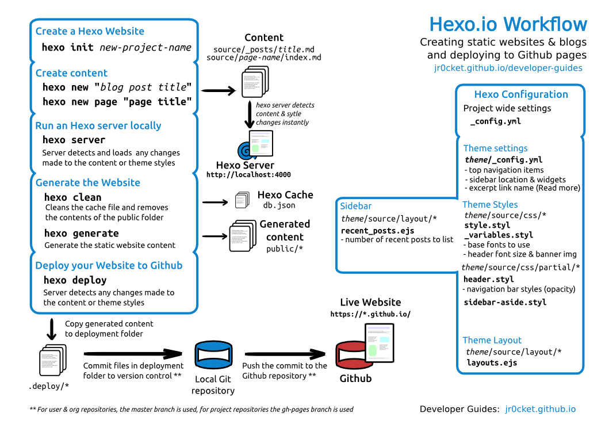

# Nbcorp-blog

<https://blog.nbcorp.fr>

Prowered by [Hexo](https://hexo.io/)

Theme: [tranquilpeak](https://github.com/LouisBarranqueiro/hexo-theme-tranquilpeak)

Plugins:

* hexo-deployer-git
* hexo-generator-cname3
* hexo-generator-feed

## Workflow

1. Create a draft: `hexo new draft "My post title"`
2. Start server with draft: `hexo serve --draft`
3. Publish the draft: `hexo publish post "My post title"`

## ToDo

- [x] code hightlights theme
- [x] finish configure theme tranquilpeak
- [x] writting workflow
- [x] moar doc here
- [x] begin to write!
- [ ] https... no wildcard with free cloudflare... need to find another workaround
